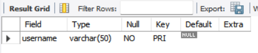

# Final Lab Task 2 Transforming ER into Relational Tables

In this laboratory task, we were given a sample Entity-Relationship (ER) model and tasked with converting it into a relational database using MySQL. We were required to identify the appropriate entities and attributes to ensure the structure is functional, as well as define the necessary primary and foreign keys to establish proper relationships between tables.

The following are the data attributes that we have to create inside a table:  
 

## Queries

 1 - **Query for Student Table**
   
   - Relation: One-to-Many
   -  `(studenttbl.username)` --> `(submissiontbl.username)`  
     
    

 2 - **Query for Assignment Table**
   
   - Relation: One-to-Many
   - `(assignmenttbl.shortname)` --> `(submissiontbl.shortname)`  
     
    

3 - **Query for Submission Table** 
   
   - Relation: Many-to-One
   - `(submissiontbl.username)` --> `(studenttbl.username)`
   - `(submissiontbl.shortname)` --> `(assignmenttbl.shortname)`  
     
    

## Table Structures

1 - Student Table Structure
  - `(studenttbl.username)` --> `(submissiontbl.username)`
  - Meaning: **One Student** can have **Many Submissions**, Each Submission requires a valid Student.  
  

2 - Assignment Table Structure 
  - `(assignmenttbl.shortname)` --> `(submissiontbl.shortname)`
  - Meaning: **One assignment** can have **Many Submissions** connected with it.  
  

3 - Submission Table Structure  
  - `(submissiontbl.username)` --> `(studenttbl.username)`
  - Meaning: **Many Submissions** belong to **One Student**.
  - `(submissiontbl.shortname)` --> `(assignmenttbl.shortname)`
  - Meaning: **Many Submissions** are linked to a **One Assignment**.
  

# Relational Tables
- Attached below is the Relational Table.  

